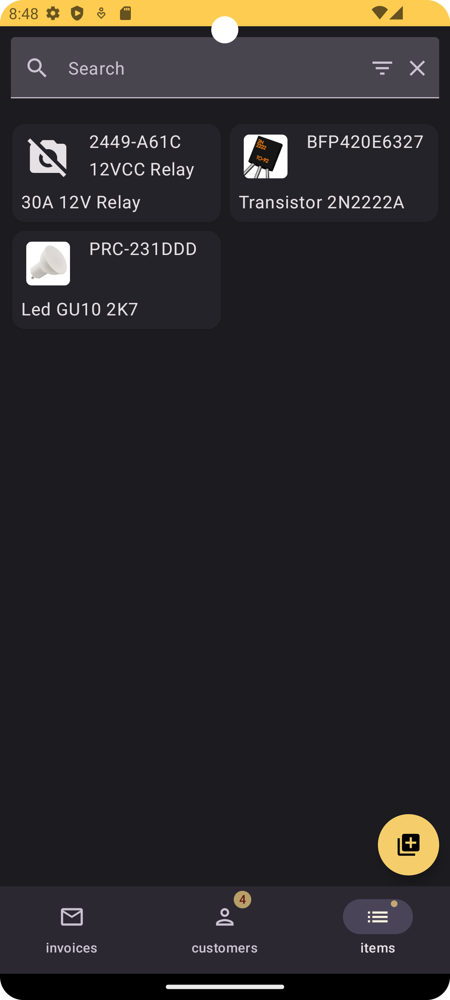

# My invoice

This is a example of a billing app, where you can add customers, items and create invoices.
Firebase Login is used to authenticate users.

|                            |                                    |
|----------------------------|------------------------------------|
|  |  |
|  |  |
