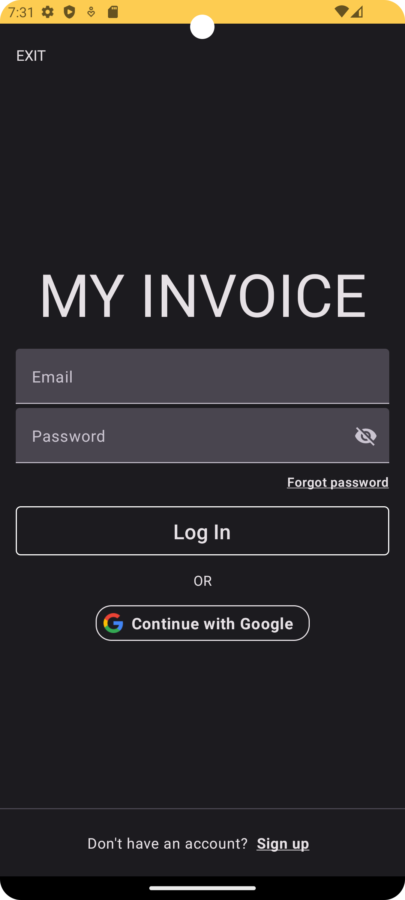
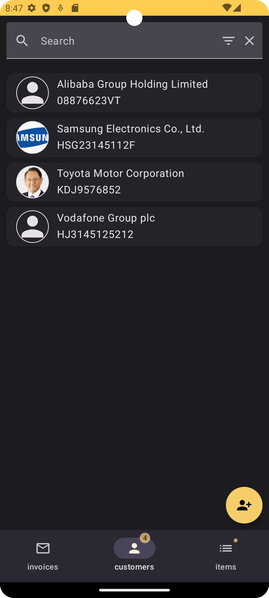
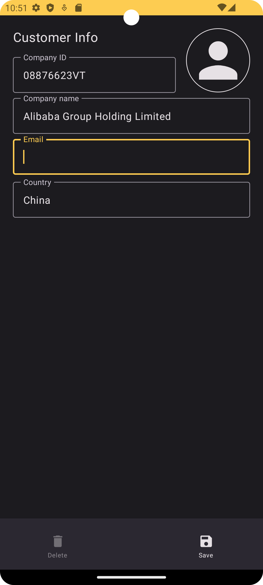

My invoice
=====

This is a example of a billing app, where you can add customers, items and create invoices.
Firebase Login is used to authenticate users.

|  |  |  |
|----------------------------|------------------------------------|--------------------------------------------|
